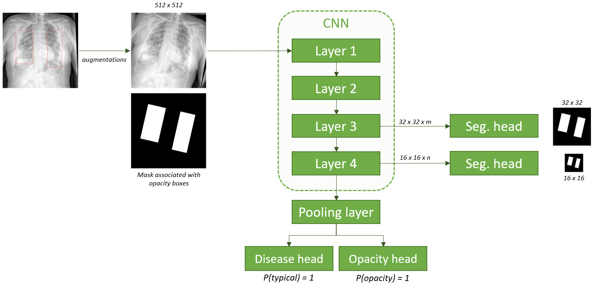

# SIIM-FISABIO-RSNA COVID-19 Detection Kaggle Competition - Theo's models

#### Author : [@theoviel](https://github.com/theoviel)

#### Status :
- Completed, should be usable.


## Introduction



This repository contains the code to train the model schematized above. It is my part of our solution that achieved rank 26th on the private leaderboard.

You can read more about it [here](https://www.kaggle.com/c/siim-covid19-detection/discussion/263895).


## How to use the repository

- Clone the repository
<!-- - [TODO : Requirements] -->

- Download the data :
  - Put the competition data from [Kaggle](https://www.kaggle.com/c/siim-covid19-detection/data) in the `input` folder
  - We also provide our trained model weights [on Kaggle](https://www.kaggle.com/theoviel/covid-cps/)

- Prepare the data :
  - Extract the hand labels using `notebooks/Extraction.ipynb`.
  - (optional) Detect duplicates using `notebooks/Duplicates.ipynb`.

- Train models using `notebooks/Training.ipynb`
  - Use the `DEBUG` parameter to launch the code in debug mode (single fold, no logging)
  - Specify the training parameters in the `Config` class. Feel free to experiment with the parameters , here are the main ones :
    - `selected_folds` : Folds to run computations for
    - `selected_model` : Model to train. Our solution uses `'tf_efficientnetv2_m_in21ft1k'` and `'tf_efficientnetv2_s_in21ft1k'`
    - `loss_config` : Loss configuration
    - `use_fp16`: Whether to use fp16 training
    - `optimizer` : Optimizer name
    - `batch_size` : Training batch size, adapt the `BATCH_SIZES` dictionary to your gpu
    - `val_bs` : Validation batch size
    - `epochs` : Number of training epochs
    - `lr` : Learning rate. Will be decayed linearly
    - `warmup_prop` : Proportion of steps to use for learning rate warmup
    - `mix_proba` : Probability to apply CutMix with
    - `mix_alpha` : Alpha parameter for CutMix

- Validate models with `notebooks/Inference.ipynb` :
  - Use the `EXP_FOLDER` parameter to specify the experiment.
  - Use the `FLIP_TTA` parameter to specify whether to use horizontal flip test time augmentations.


## Code structure

If you wish to dive into the code, the repository naming should be straight-forward. Each function is documented.
The structure is the following :

```
code
├── data
│   ├── dataset.py      # Torch datasets
│   ├── extraction.py   # Data extaction
│   ├── preparation.py  # Dataframe preparation
│   └── transforms.py   # Augmentations
├── inference 
│   ├── main.py         # Inference for the val data
│   └── predict.py      # Predict function
├── model_zoo 
│   ├── encoders.py     # Encoders utils
│   └── models.py       # Model definition
├── training 
│   ├── loader.py       # Data loaders
│   ├── losses.py       # Loss functions
│   ├── main.py         # Training main
│   ├── mix.py          # CutMix
│   ├── optim.py        # Optimizer handling
│   └── train.py        # Fitting a model
├── utils 
│   ├── logger.py       # Bounding boxes utils
│   ├── logger.py       # Logging utils
│   ├── metrics.py      # Metrics for the competition
│   ├── plots.py        # Plotting utils
│   └── torch.py        # Torch utils
└── params.py           # Main parameters
``` 
